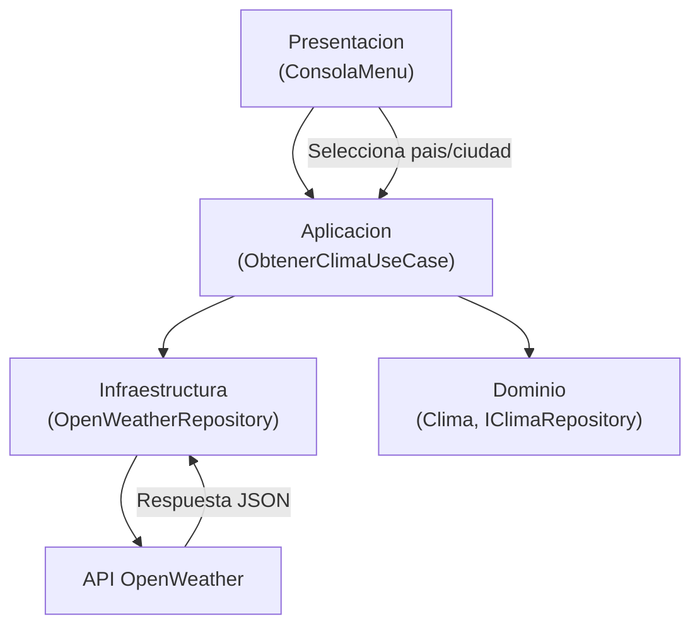
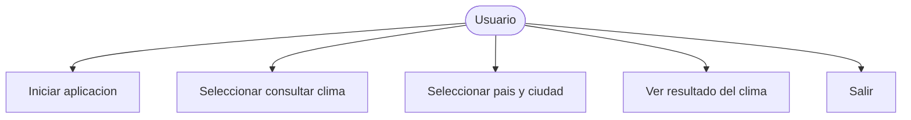
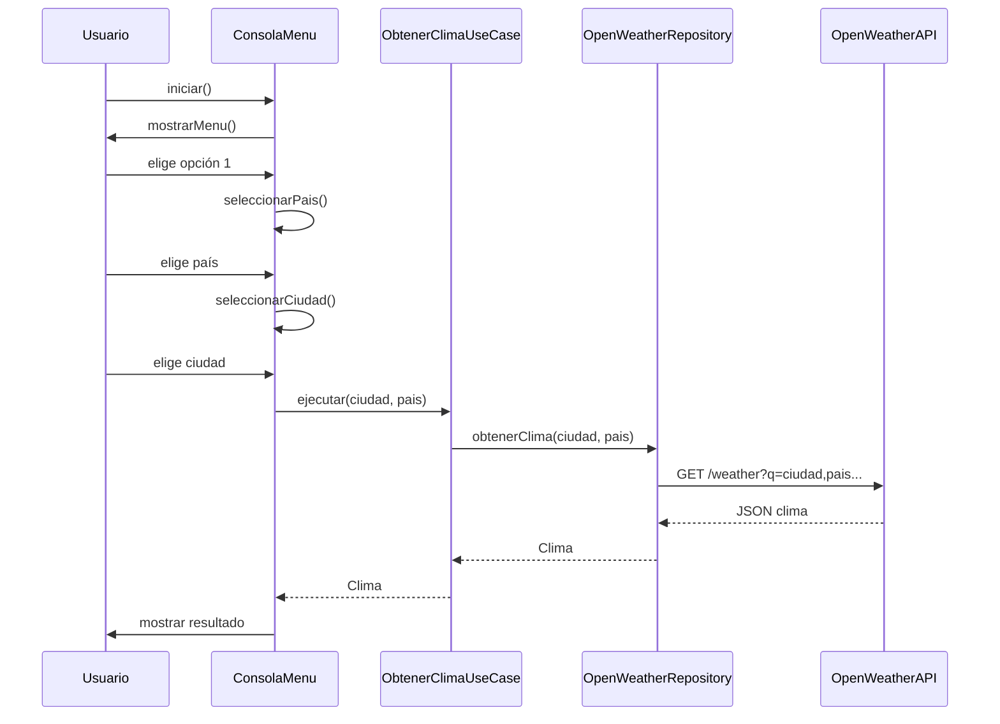
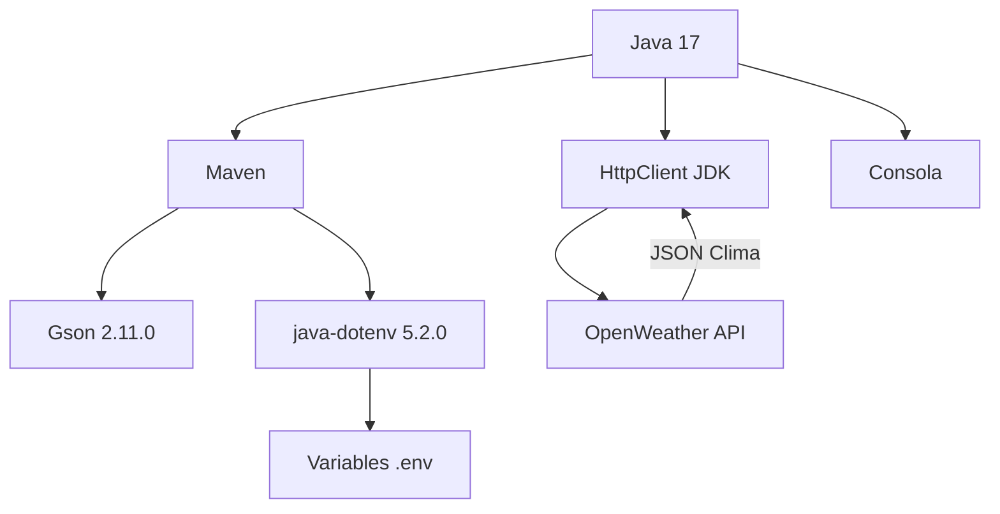

# CIELOSCOPIO Alura

Aplicación de consola en Java para consultar el clima actual desde la API de OpenWeather. El proyecto está desarrollado para cumplir el reto Cieloscopio de los cursos de Alura Latam y está organizado con una arquitectura limpia que separa las capas de presentación, aplicación, dominio e infraestructura.

## Autor

- Creado por: Participante del reto Cieloscopio de Alura Latam
- Proyecto desarrollado como parte de los cursos de programación de Alura

## Funcionalidades

- Menú interactivo de consola con opciones para:
  - Consultar el clima
  - Salir de la aplicación
- Selección de país y ciudad desde opciones predefinidas
- Consulta del clima real usando OpenWeather API
- Validación de entrada para ciudad y país
- Mensajes de estado y animación simple durante la carga
- Presentación de datos climáticos:
  - Ciudad
  - País
  - Descripción del clima
  - Temperatura en °C
  - Porcentaje de humedad
- Arquitectura basada en capas:
  - `presentation` → Interacción con el usuario
  - `application` → Lógica del caso de uso
  - `domain` → Modelos y contrato de repositorio
  - `infrastructure` → Integración con la API externa

## Estructura del proyecto

- `Main.java` → Punto de entrada de la aplicación
- `ConsolaMenu.java` → Interfaz de usuario y flujo de menú
- `ObtenerClimaUseCase.java` → Lógica de negocio para obtener clima
- `IClimaRepository.java` → Contrato del repositorio de clima
- `OpenWeatherRepository.java` → Implementación HTTP de la API OpenWeather
- `Clima.java` → Registro de datos del clima
- `EPais.java` / `ECiudad.java` → Listado de países y ciudades soportados

## Requisitos

- Java 17
- Maven
- Clave de API de OpenWeather

## Configuración

1. Crear un archivo `.env` en la raíz del proyecto.
2. Agregar las variables:

```env
OPENWEATHER_API_KEY=tu_clave_de_api_aqui
OPENWEATHER_API_URL=https://api.openweathermap.org/data/2.5/weather
```

> No compartas ni subas la clave de API a un repositorio público. Asegúrate de incluir `.env` en `.gitignore`.

## Compilación y ejecución

```bash
mvn clean compile
mvn exec:java -D exec.mainClass=com.alura.Main -D file.encoding=UTF-8
```

## Diagrama de arquitectura



## Diagrama de casos de uso



## Diagrama de secuencia



## Diagrama del stack utilizado



## Consideraciones

- La aplicación depende de variables de entorno para la clave de API.
- Si la URL o la clave no están configuradas, la aplicación falla con un error claro.
- Actualmente solo está definido el país Bolivia (`BO`) con varias ciudades.
- El archivo `.env` no debe compartirse en el control de versiones.
- El proyecto se diseñó en el contexto del reto Cieloscopio de Alura Latam.

## Estado de tareas del tablero de Trello

A continuación se muestra el estado del reto Cieloscópio alineado con el código actual del proyecto.

### Tareas completadas

- `1) Configurando el entorno Java`
  - Proyecto Maven con Java 17 configurado en `pom.xml`.
- `3) Importando la biblioteca Gson en Intellij`
  - Dependencia `com.google.code.gson:gson:2.11.0` definida en `pom.xml`.
- `2) Conociendo la API para traer datos`
  - `OpenWeatherRepository` construye consultas a la API de OpenWeather y lee `OPENWEATHER_API_URL` y `OPENWEATHER_API_KEY` desde `.env`.
- `4) Construyendo la Solicitud y la Respuesta`
  - Se crea y envía un `HttpRequest` HTTP GET y se recibe la respuesta de OpenWeather.
- `5) Datos de la ciudad y solicitud principal`
  - `EPais` y `ECiudad` modelan país y ciudad, y `ConsolaMenu` gestiona la selección y llama a `ObtenerClimaUseCase`.
- `6) Analizando la respuesta en formato JSON`
  - Se usa `JsonParser` de Gson para convertir la respuesta JSON en un objeto Java.
- `7) Filtrando los datos meteorológicos`
  - Se extraen temperatura, humedad y descripción del clima y se mapean en `Clima`.
- `8) Interactuando con el usuario`
  - `ConsolaMenu` muestra el menú, lee la entrada del usuario y presenta los resultados.
- `Haz un README`
  - Este archivo `README.md` documenta el proyecto, el stack, los diagramas y las instrucciones.
- `Crear el repositorio de tu proyecto en GitHub`
  - El proyecto contiene `.git/` y `.gitignore`.

### Tareas pendientes

- `Extra (Opcional)`
  - No hay ninguna funcionalidad adicional opcional implementada actualmente.
- `Extra - Conociendo otra API de datos climáticos`
  - El proyecto solo integra la API de OpenWeather; no hay soporte para una segunda API.

## Mejora futura

- Agregar más países y ciudades.
- Soporte para entrada libre de ciudad.
- Caching de respuestas para reducir llamadas a la API.
- Mejorar el manejo de errores y mostrar mensajes más amigables.
